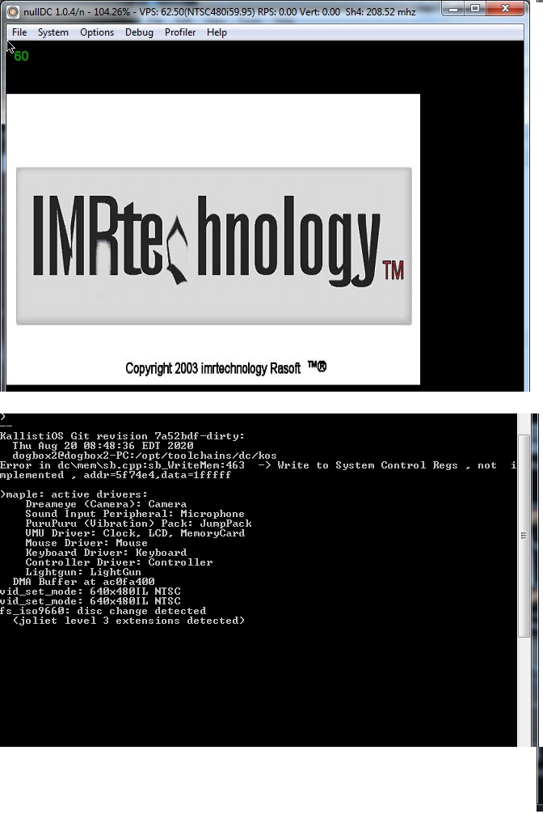

# SDL_PVRIMAGE
Modded example of SDL_image for dreamcast that can use PVR video format
  
Using pvr image not bmp saves a lot of ram 
Based on //
//  SegaPVRImage.h
//  SEGAPVR
//
//  Created by Yevgeniy Logachev on 4/13/14.
//  Copyright (c) 2014 yev. All rights reserved.
//
Modded to work on all verison of kos from 2.0 to 1.3svn gcc from 3.0 to 4.7

Included libary and example source and precompiled for dreamSDK might have to change your paths if they dont match
Example can load many more formats 
Ian micheal
